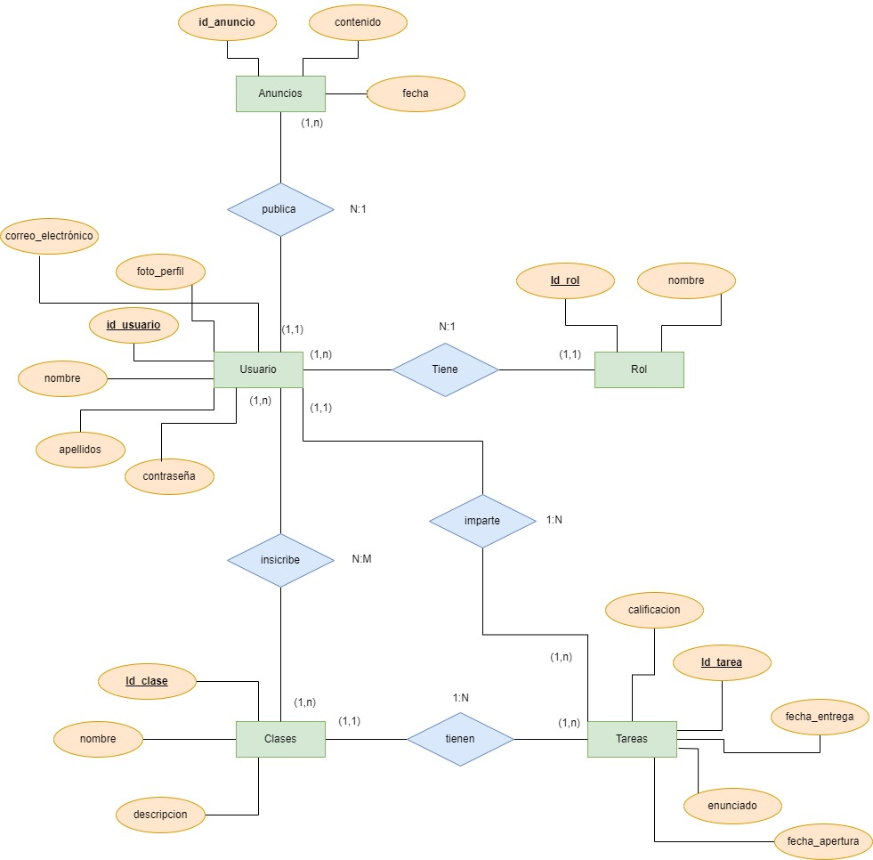

# Plataforma Educativa Interactiva - EduVibe

#### Curso Escolar 2023-2024
#### Autor: [Javier Pintado Navarro](https://github.com/javipintado3)
#### Tutor: [Antonio Gabriel González Casado](https://github.com/antonio-gabriel-gonzalez-casado)
#### Fecha de Inicio: 15/03/2024
#### Fecha de Finalización: 12/06/2024

## Breve descripción del proyecto

EduVibe va a ser una aplicación web diseñada para ofrecer un entorno de aprendizaje interactivo y eficiente para profesores y estudiantes. La plataforma se enfoca en proporcionar herramientas específicas para la gestión de clases y la interacción entre profesores y estudiantes, con el objetivo de mejorar la experiencia
educativa en línea.

## Definir el objetivo de la aplicación

- **¿Qué va a hacer la aplicación?**
  
- La aplicación "EduVibe" proporcionará un entorno educativo interactivo y eficiente para profesores y estudiantes. Permitirá la gestión de clases, la asignación y seguimiento de tareas, la comunicación entre profesores y estudiantes, y la gestión de usuarios con roles diferenciados.
  
- **¿Cuál es su atractivo principal?**
  
- El principal atractivo de EduVibe radica en su enfoque en la mejora de la experiencia educativa en línea al proporcionar herramientas específicas para la gestión de clases y la interacción entre profesores y estudiantes. Además, busca abordar las deficiencias observadas en otras plataformas educativas, ofreciendo un entorno más eficiente y fácil de usar.
  
- **¿Qué problema concreto va a resolver?**
  
- EduVibe busca resolver la falta de herramientas específicas y eficientes para la gestión de clases y la interacción entre profesores y estudiantes en entornos educativos en línea. Al abordar estas deficiencias, la aplicación busca mejorar la experiencia educativa en línea y hacer que el proceso de enseñanza y aprendizaje sea más efectivo y satisfactorio.
  
- **¿Qué necesidad va a cubrir?**

- La aplicación EduVibe tiene como objetivo ayudar a los profesores y estudiantes en sus clases en línea. Con más personas aprendiendo desde casa, se necesita una manera fácil y divertida de enseñar y aprender en internet. EduVibe viene a ser esa herramienta amigable que hace que las clases sean más interesantes y fáciles de seguir. Con funciones especiales para tareas, comunicación entre profesores y alumnos, y una forma sencilla de organizar las clases, EduVibe está diseñada para hacer que la educación en línea sea más accesible y agradable para todos

## Estructura del Proyecto

- src-api
- src-frontend
- docs
- README.md

## Modelo Entidad-Relación

#### Entidades y Atributos

| Entidad   | Atributos                                      |
|-----------|------------------------------------------------|
| Usuario   | UsuarioID, Nombre, Correo, Contraseña, RolID  |
| ListadoClase  | ClaseID, UsuarioID |
| Clase     | ClaseID, Nombre, Descripcion |
| Rol       | RolID, Nombre |
| Tarea     | TareaID, Titulo, Descripcion, Fecha_Entrega, Nota, ClaseID, UsuarioID |
| Anuncios  | AnuncioID,, Contenido, Fecha, UsuarioID |

#### Relaciones

- Relacion entre Usuario y Anuncio: un anuncio es publicado por un unico profesor y un profesor publica uno o muchos anuncios.
- Relación entre Usuario y Clase: se crea una nueva tabla llamada ListadoClase ya que es una relación uno a muchos donde se guarda el id del alumno y de la clase.
- Relación entre Usuario y Rol: un usuario solo tiene un unico rol y los roles pueden tenerlos muchos usuarios.
- Relación entre Clase y Tarea: una clase tiene muchas tareas, pero una tarea solo tiene una clase.
- Relación entre Usuario y Tarea: un usuario tiene una o muchas tareas, pero una tarea esta asignada solo a ese usuario.

