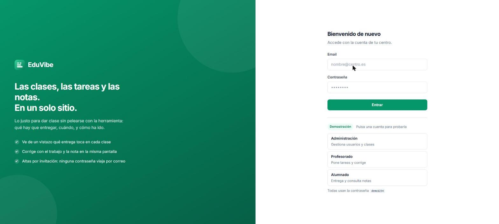
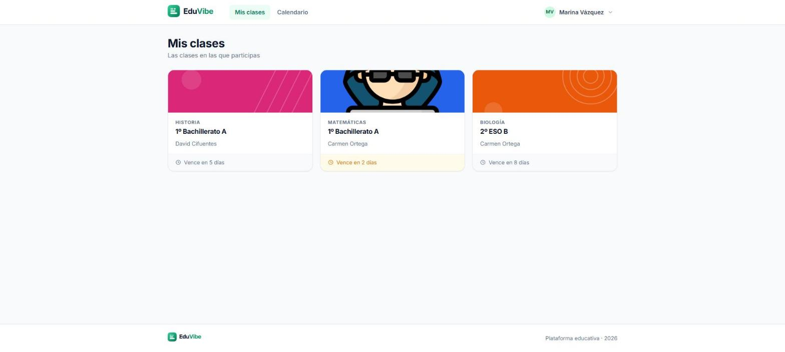
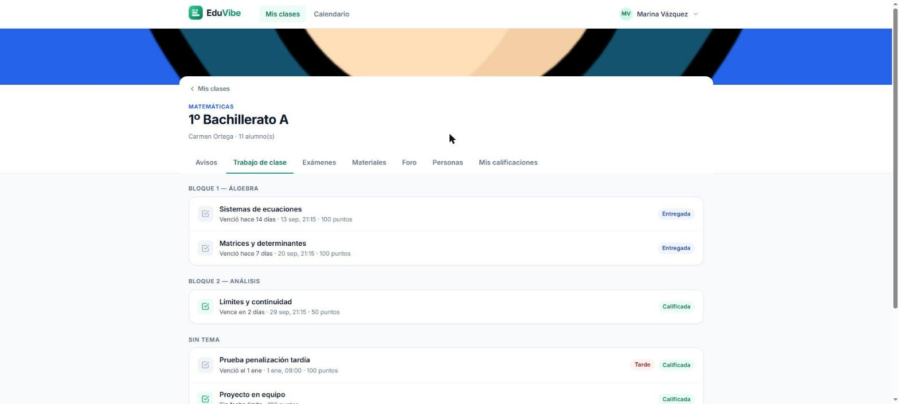

# EduVibe

**Plataforma educativa full-stack**, a medio camino entre Google Classroom (simplicidad) y Moodle (estructura): clases, tareas, exámenes cronometrados, rúbricas de corrección, entregas grupales y foros, con un backend en capas y permisos resueltos en servidor.


## Capturas

| Login | Mis clases | Trabajo de clase |
|---|---|---|
|  |  |  |

## Por qué existe

No es un CRUD de práctica: es un ejercicio de construir, de verdad, las partes de una plataforma educativa que suelen quedarse fuera de un proyecto de portafolio por falta de tiempo — corrección con rúbrica, penalización automática por entrega tardía, media ponderada, entregas de un subgrupo entero, un banco de preguntas reutilizable entre exámenes. Cada pieza se probó a mano en el navegador contra el backend real antes de darla por cerrada, no solo compilando.

## Funcionalidades

**Cuentas y acceso**
- Sin registro público: el alta la hace admin, por invitación con token de un solo uso (nunca se envía una contraseña por email).
- Tres roles (administración, profesorado, alumnado) con permisos resueltos en el backend según la relación real con cada clase, no solo por rol — un profesor no puede tocar la clase de otro.

**Clases y trabajo**
- Clases con temas, avisos fijables, materiales (con restricción de visibilidad por fecha) y matriculación.
- Tareas con fecha límite, puntos, y tres mecanismos de evaluación real:
  - **Rúbricas**: criterios con su propia puntuación, visibles antes de entregar; la nota final es la suma de lo puntuado en cada uno.
  - **Ponderación**: cada tarea pesa lo que se le diga en la media de la clase (una media normal no compara tareas de puntuaciones distintas).
  - **Penalización por entrega tardía**: un porcentaje configurable, aplicado automáticamente al calificar.
- **Entrega grupal**: subgrupos reutilizables por clase; entregar o calificar una tarea grupal se propaga a todo el equipo, sin duplicar filas de nota.

**Exámenes**
- Preguntas de opción múltiple con corrección automática y cronómetro.
- Banco de preguntas reutilizable entre exámenes de la misma clase (se copian, no se comparte fila: retocar el original no afecta a intentos ya hechos).
- Orden aleatorio de preguntas y respuestas por alumno, estable si recarga la página.

**Comunicación**
- Foro de debate por clase, abierto a todo el mundo matriculado (no solo profesorado), con moderación de mensajes.
- Notificaciones in-app (tarea nueva, nota publicada, aviso nuevo) y calendario mensual con las fechas de entrega ya integradas.

**Perfil y administración**
- Resumen de perfil por rol, foto de perfil, y panel de administración de usuarios con alta masiva.

## Arquitectura

**Backend** — capas estrictas y sin atajos:

```
controller/   REST fino: valida entrada, llama al servicio, no lleva lógica
service/      reglas de negocio, permisos (ClassAccessService centraliza "quién puede ver/editar qué")
repository/   Spring Data JPA, sin devolver entidades por la API
dto/          contratos de entrada y salida, separados de las entidades
model/        entidades JPA
```

- Migraciones versionadas con **Flyway**, nunca `ddl-auto=update`.
- Inyección por constructor en todo el proyecto, cero `@Autowired` en campos.
- Datos de demostración cargados como migración repetible (`db/demo`), no hardcodeados.

**Frontend** — Angular standalone, sin NgRx:

- Componentes standalone con `loadComponent` (carga diferida por ruta), estado con **señales** (`signal`/`computed`), nada de `BehaviorSubject` para estado local.
- Sistema de diseño propio: sin Material ni Bootstrap. Confirmaciones destructivas con un diálogo propio, nunca `window.confirm`.
- Un servicio por dominio (`TareasService`, `ForoService`...); los componentes nunca llaman a `HttpClient` directamente.

## Stack

| | |
|---|---|
| Backend | Java 17 · Spring Boot 3.2 (Web, Security, Data JPA, Validation) · JWT propio |
| Frontend | Angular 17 (standalone + signals) · TypeScript |
| Base de datos | PostgreSQL 16 · Flyway |
| Infraestructura | Docker Compose (API + frontend + Postgres), subida de archivos a disco con volumen propio |

## Cómo arrancarlo

**Con Docker (recomendado):**

```bash
docker compose up -d --build
```

Backend en `:9090`, frontend en `:80`, Postgres con volumen persistente. La base incluye datos de demostración: tres cuentas (administración, profesorado, alumnado), todas con contraseña `demo1234`.

**En local, para desarrollar:**

```bash
# Base de datos
docker compose up -d db

# Backend (puerto 9090)
cd src-api/EduvibeBackend && ./mvnw spring-boot:run

# Frontend (puerto 4200)
cd src-frontend/EduVibeFront && npm install && npm start
```

## Estructura del repositorio

```
src-api/EduvibeBackend/     API REST (Spring Boot)
src-frontend/EduVibeFront/  SPA (Angular)
docs/                       memoria del proyecto y capturas
Docker-compose.yml
```

## Autor

**Javier Pintado Navarro** — [GitHub](https://github.com/javipintado3) · [LinkedIn](https://www.linkedin.com/in/javier-pintado-navarro-06811a2ab/) · [Portafolio](https://javier-pintado-portfolio.vercel.app/)
